# Detailed Climate Insights by District

This document presents a detailed analysis of climate trends, variability, and correlations for each district.

Generated on: 2025-11-20 

##  Anuradhapura 

### 1. Trend Analysis
Significant trends detected:
- **Temperature (DJF)**: Increasing trend (Slope: 0.0114, p=8.62e-13)
- **Temperature (JJA)**: Increasing trend (Slope: 0.0069, p=1.81e-11)
- **Temperature (MAM)**: Increasing trend (Slope: 0.0087, p=2.25e-10)
- **Temperature (SON)**: Increasing trend (Slope: 0.0072, p=1.51e-09)
- **Temperature (Annual)**: Increasing trend (Slope: 0.0078, p=6.18e-07)

### 2. Rainfall-Temperature Correlation
No strong correlations detected.

### 3. Variability (CV %)
| Season | CV (%) | Variability Level |
| :--- | :--- | :--- |
| DJF | 53% | High |
| JJA | 77.2% | High |
| MAM | 40.5% | Moderate |
| SON | 30% | Moderate |
| Annual | 23.6% | Moderate |

### 4. Visualizations
#### Annual Time Series

#### Seasonal Anomalies
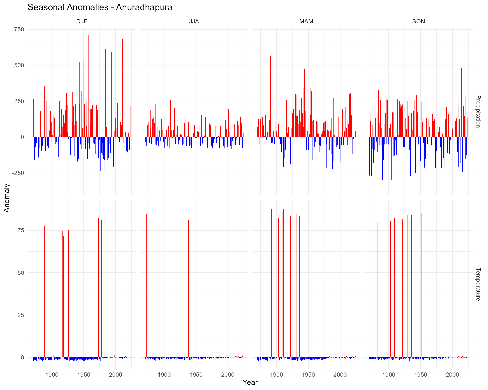

#### Seasonal Variability
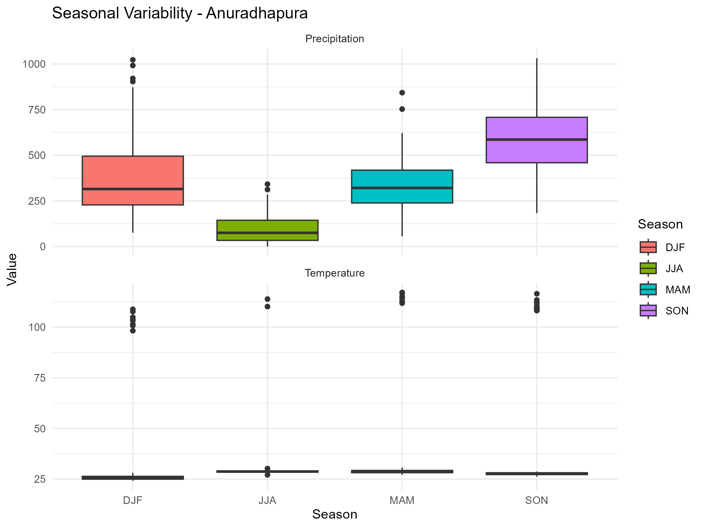

---

##  Badulla 

### 1. Trend Analysis
Significant trends detected:
- **Temperature (DJF)**: Increasing trend (Slope: 0.004, p=0.00179)
- **Temperature (JJA)**: Increasing trend (Slope: 0.0091, p=6.2e-17)
- **Temperature (MAM)**: Increasing trend (Slope: 0.008, p=5.6e-11)
- **Temperature (SON)**: Increasing trend (Slope: 0.0043, p=6.41e-06)
- **Temperature (Annual)**: Increasing trend (Slope: 0.0053, p=7.33e-07)

### 2. Rainfall-Temperature Correlation
No strong correlations detected.

### 3. Variability (CV %)
| Season | CV (%) | Variability Level |
| :--- | :--- | :--- |
| DJF | 46.5% | Moderate |
| JJA | 47% | Moderate |
| MAM | 34.2% | Moderate |
| SON | 31.9% | Moderate |
| Annual | 21.1% | Moderate |

### 4. Visualizations
#### Annual Time Series

#### Seasonal Anomalies
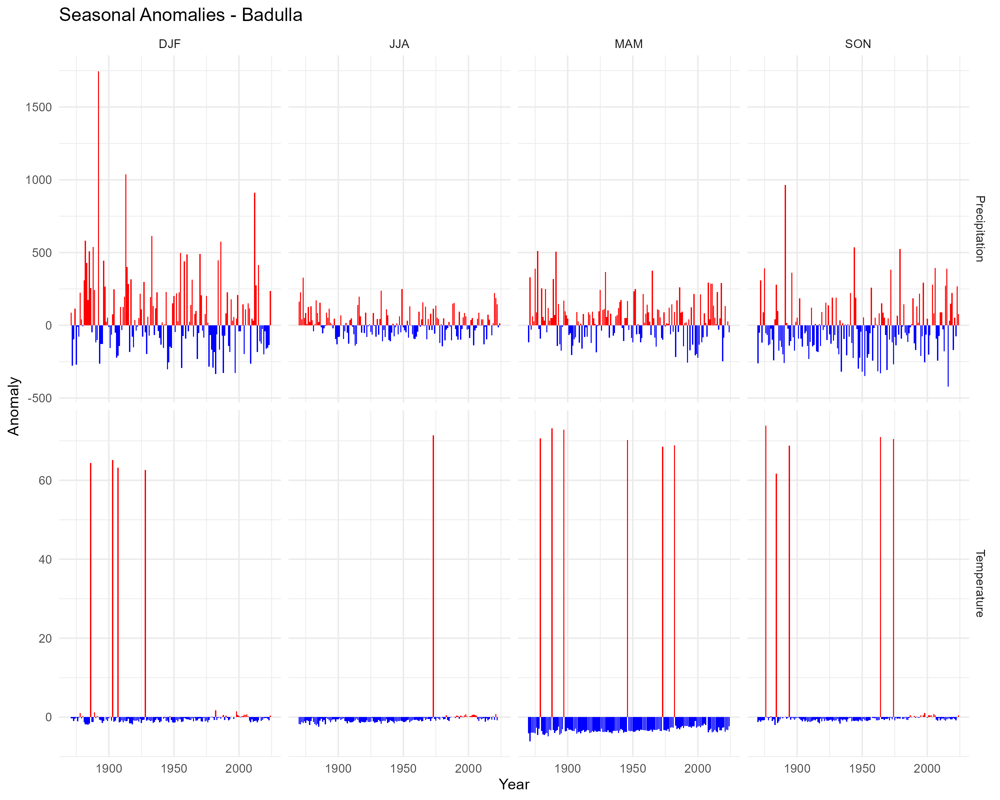

#### Seasonal Variability
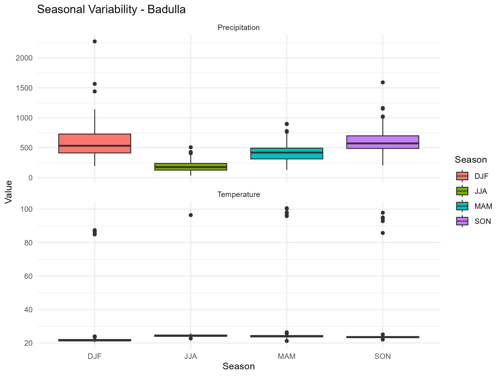

---

##  Batticaloa 

### 1. Trend Analysis
Significant trends detected:
- **Temperature (DJF)**: Increasing trend (Slope: 0.0054, p=3.72e-10)
- **Temperature (JJA)**: Increasing trend (Slope: 0.0062, p=1.45e-09)
- **Temperature (MAM)**: Increasing trend (Slope: 0.0048, p=7.42e-07)
- **Temperature (SON)**: Increasing trend (Slope: 0.004, p=6.5e-07)
- **Precipitation (Annual)**: Increasing trend (Slope: 1.6975, p=0.011)
- **Temperature (Annual)**: Increasing trend (Slope: 0.0048, p=7.7e-08)

### 2. Rainfall-Temperature Correlation
No strong correlations detected.

### 3. Variability (CV %)
| Season | CV (%) | Variability Level |
| :--- | :--- | :--- |
| DJF | 44.9% | Moderate |
| JJA | 59.7% | High |
| MAM | 57.8% | High |
| SON | 37.6% | Moderate |
| Annual | 24.9% | Moderate |

### 4. Visualizations
#### Annual Time Series

#### Seasonal Anomalies
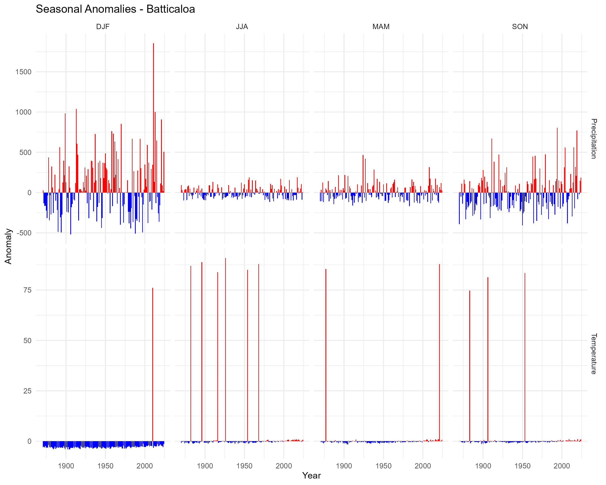

#### Seasonal Variability
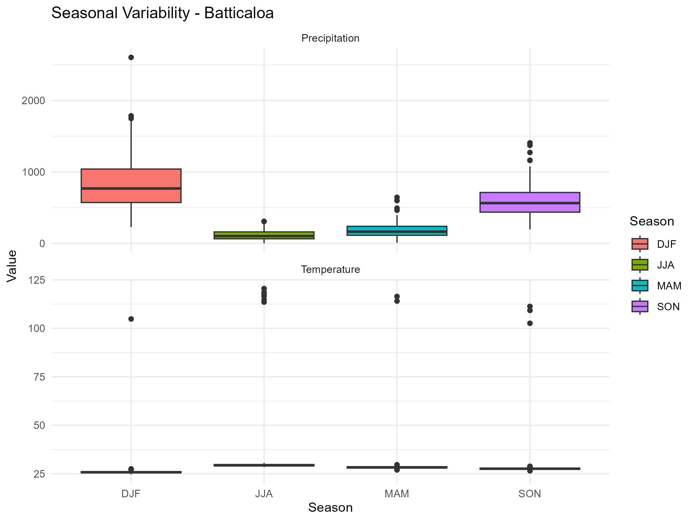

---

##  Colombo 

### 1. Trend Analysis
Significant trends detected:
- **Precipitation (DJF)**: Increasing trend (Slope: 0.6667, p=0.0196)
- **Precipitation (SON)**: Increasing trend (Slope: 1.9905, p=8.39e-05)
- **Temperature (DJF)**: Increasing trend (Slope: 0.0061, p=1.58e-08)
- **Temperature (JJA)**: Increasing trend (Slope: 0.0067, p=9.2e-15)
- **Temperature (MAM)**: Increasing trend (Slope: 0.0053, p=2.36e-07)
- **Temperature (SON)**: Increasing trend (Slope: 0.0048, p=2.91e-08)
- **Precipitation (Annual)**: Increasing trend (Slope: 3, p=0.000796)
- **Temperature (Annual)**: Increasing trend (Slope: 0.0061, p=5.5e-12)

### 2. Rainfall-Temperature Correlation
No strong correlations detected.

### 3. Variability (CV %)
| Season | CV (%) | Variability Level |
| :--- | :--- | :--- |
| DJF | 48.5% | Moderate |
| JJA | 47.6% | Moderate |
| MAM | 32.5% | Moderate |
| SON | 34.1% | Moderate |
| Annual | 21.8% | Moderate |

### 4. Visualizations
#### Annual Time Series

#### Seasonal Anomalies
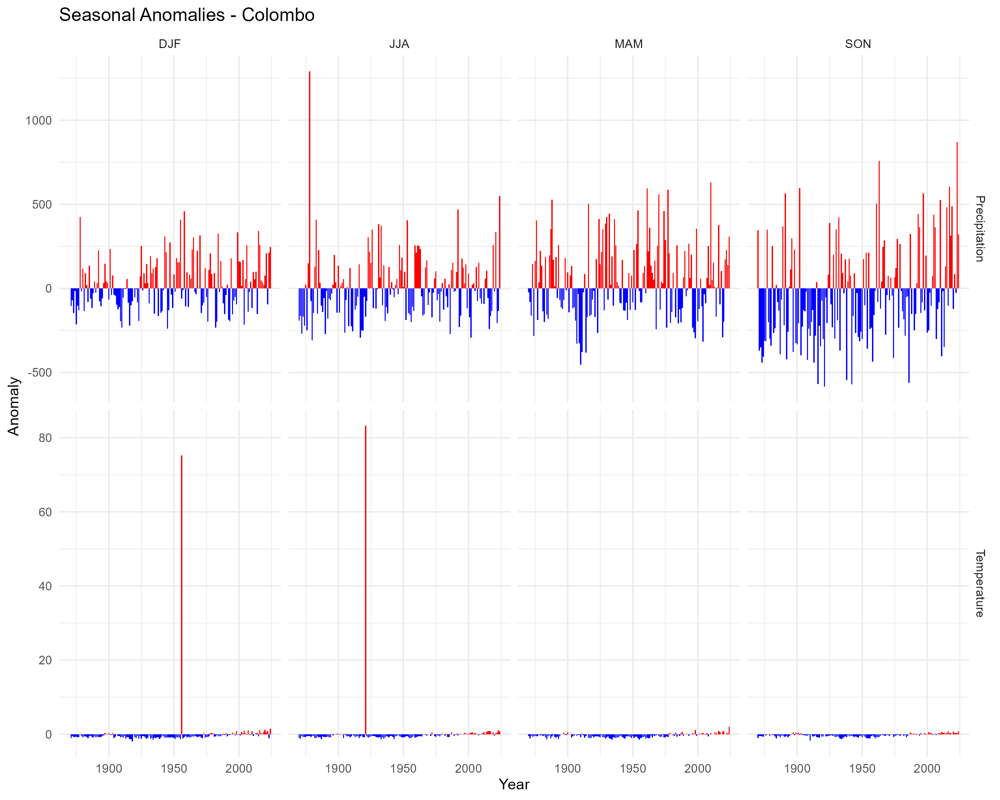

#### Seasonal Variability
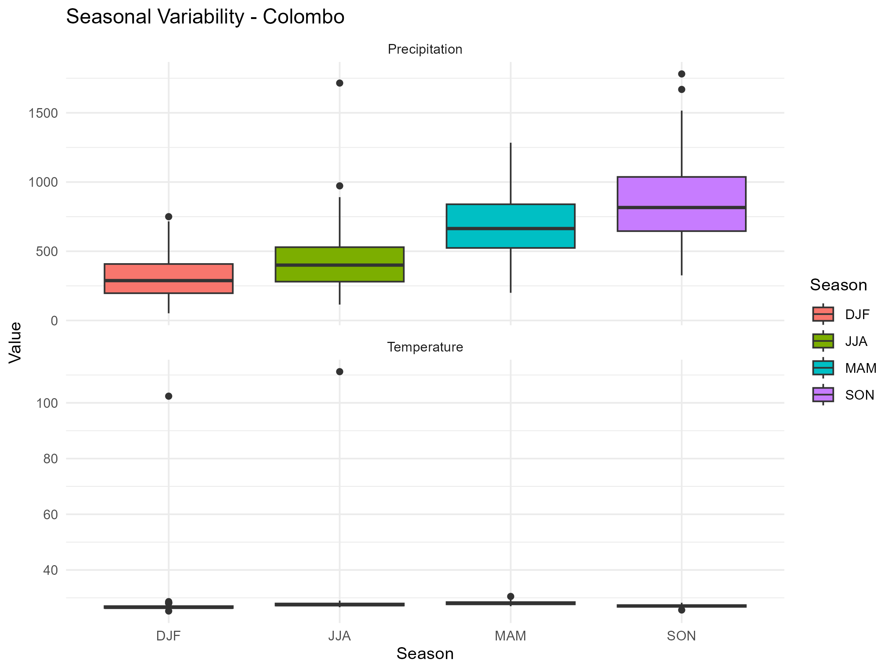

---

##  Galle 

### 1. Trend Analysis
Significant trends detected:
- **Precipitation (SON)**: Increasing trend (Slope: 0.8108, p=0.0367)
- **Temperature (DJF)**: Increasing trend (Slope: 0.0073, p=1.5e-13)
- **Temperature (JJA)**: Increasing trend (Slope: 0.0039, p=1.9e-06)
- **Temperature (MAM)**: Increasing trend (Slope: 0.0048, p=8.88e-07)
- **Temperature (SON)**: Increasing trend (Slope: 0.0045, p=4.31e-06)
- **Temperature (Annual)**: Increasing trend (Slope: 0.0048, p=2.7e-06)

### 2. Rainfall-Temperature Correlation
No strong correlations detected.

### 3. Variability (CV %)
| Season | CV (%) | Variability Level |
| :--- | :--- | :--- |
| DJF | 41.5% | Moderate |
| JJA | 30.4% | Moderate |
| MAM | 32.7% | Moderate |
| SON | 31.2% | Moderate |
| Annual | 17.9% | Low |

### 4. Visualizations
#### Annual Time Series

#### Seasonal Anomalies
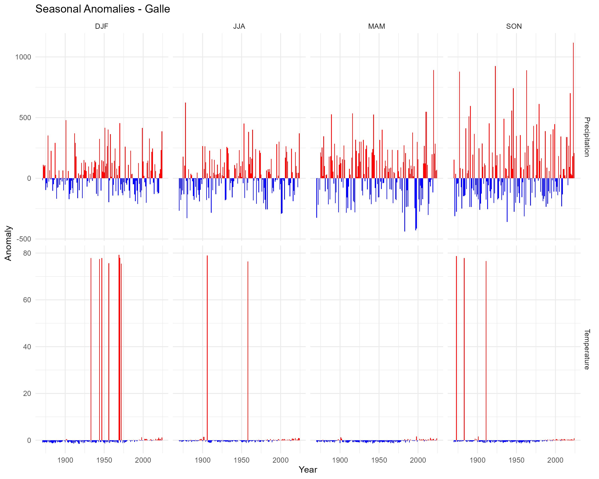

#### Seasonal Variability
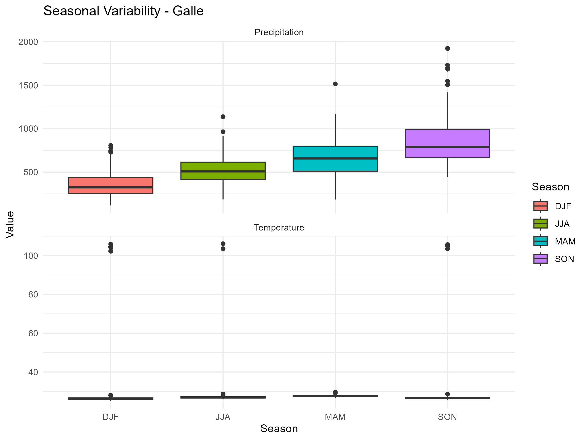

---

##  Hambanthota 

### 1. Trend Analysis
Significant trends detected:
- **Precipitation (SON)**: Increasing trend (Slope: 0.7553, p=0.0115)
- **Temperature (DJF)**: Increasing trend (Slope: 0.0092, p=4.02e-18)
- **Temperature (JJA)**: Increasing trend (Slope: 0.0067, p=1.36e-09)
- **Temperature (MAM)**: Increasing trend (Slope: 0.007, p=1.16e-12)
- **Temperature (SON)**: Increasing trend (Slope: 0.006, p=3.38e-13)
- **Temperature (Annual)**: Increasing trend (Slope: 0.0068, p=3.89e-13)

### 2. Rainfall-Temperature Correlation
No strong correlations detected.

### 3. Variability (CV %)
| Season | CV (%) | Variability Level |
| :--- | :--- | :--- |
| DJF | 51.4% | High |
| JJA | 55.5% | High |
| MAM | 47.5% | Moderate |
| SON | 46.8% | Moderate |
| Annual | 25.8% | Moderate |

### 4. Visualizations
#### Annual Time Series

#### Seasonal Anomalies
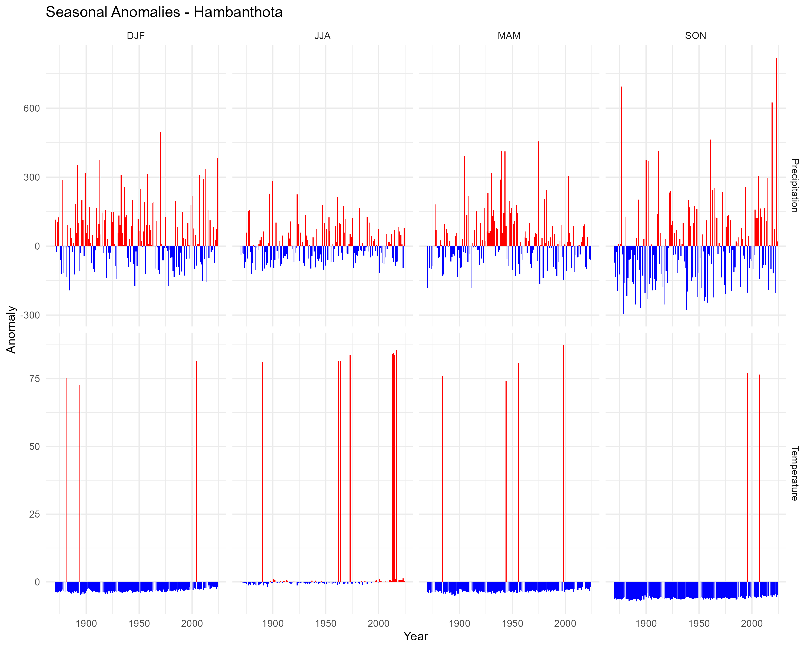

#### Seasonal Variability
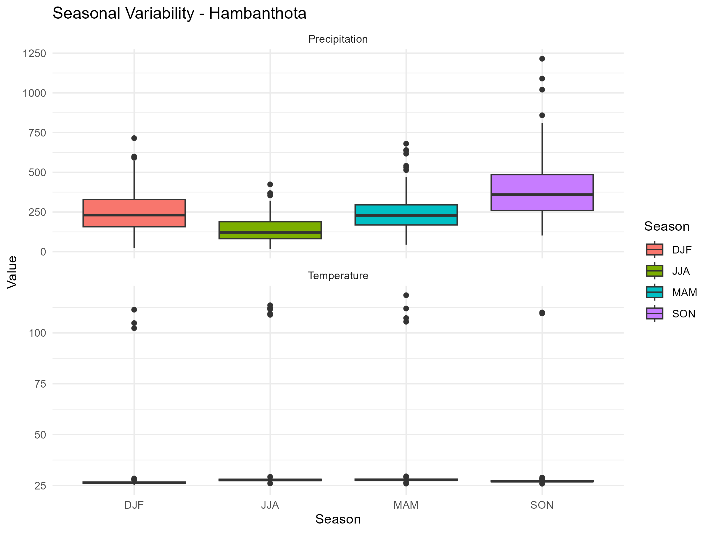

---

##  Kandy 

### 1. Trend Analysis
Significant trends detected:
- **Precipitation (JJA)**: Decreasing trend (Slope: -1.9205, p=2.68e-12)
- **Temperature (JJA)**: Increasing trend (Slope: 0.0045, p=3.2e-07)
- **Temperature (SON)**: Increasing trend (Slope: 0.0033, p=8.39e-05)
- **Precipitation (Annual)**: Decreasing trend (Slope: -2.4211, p=0.000349)
- **Temperature (Annual)**: Increasing trend (Slope: 0.0021, p=0.0057)

### 2. Rainfall-Temperature Correlation
No strong correlations detected.

### 3. Variability (CV %)
| Season | CV (%) | Variability Level |
| :--- | :--- | :--- |
| DJF | 47.9% | Moderate |
| JJA | 38.1% | Moderate |
| MAM | 37.8% | Moderate |
| SON | 23.8% | Moderate |
| Annual | 17.4% | Low |

### 4. Visualizations
#### Annual Time Series

#### Seasonal Anomalies
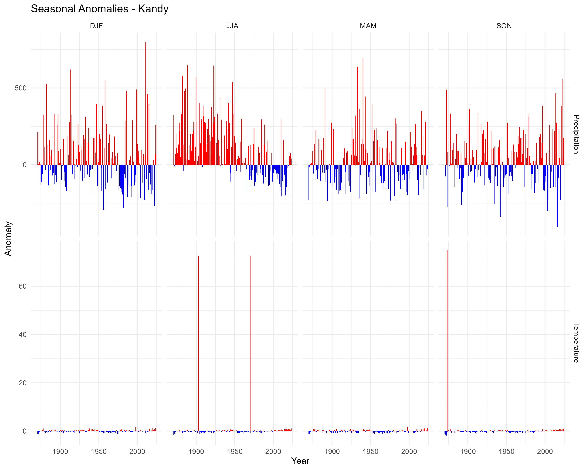

#### Seasonal Variability
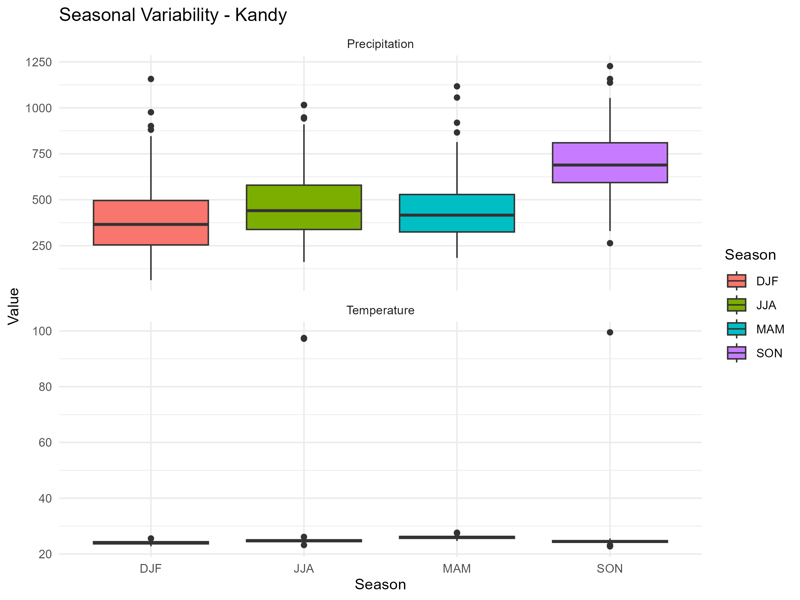

---

##  Mannar 

### 1. Trend Analysis
Significant trends detected:
- **Temperature (DJF)**: Increasing trend (Slope: 0.007, p=3.39e-11)
- **Temperature (JJA)**: Increasing trend (Slope: 0.0024, p=0.0136)
- **Temperature (MAM)**: Increasing trend (Slope: 0.0019, p=0.0487)
- **Temperature (SON)**: Increasing trend (Slope: 0.0031, p=0.00024)
- **Temperature (Annual)**: Increasing trend (Slope: 0.0036, p=6.8e-05)

### 2. Rainfall-Temperature Correlation
No strong correlations detected.

### 3. Variability (CV %)
| Season | CV (%) | Variability Level |
| :--- | :--- | :--- |
| DJF | 58.1% | High |
| JJA | 220.5% | High |
| MAM | 54% | High |
| SON | 41.3% | Moderate |
| Annual | 27% | Moderate |

### 4. Visualizations
#### Annual Time Series

#### Seasonal Anomalies
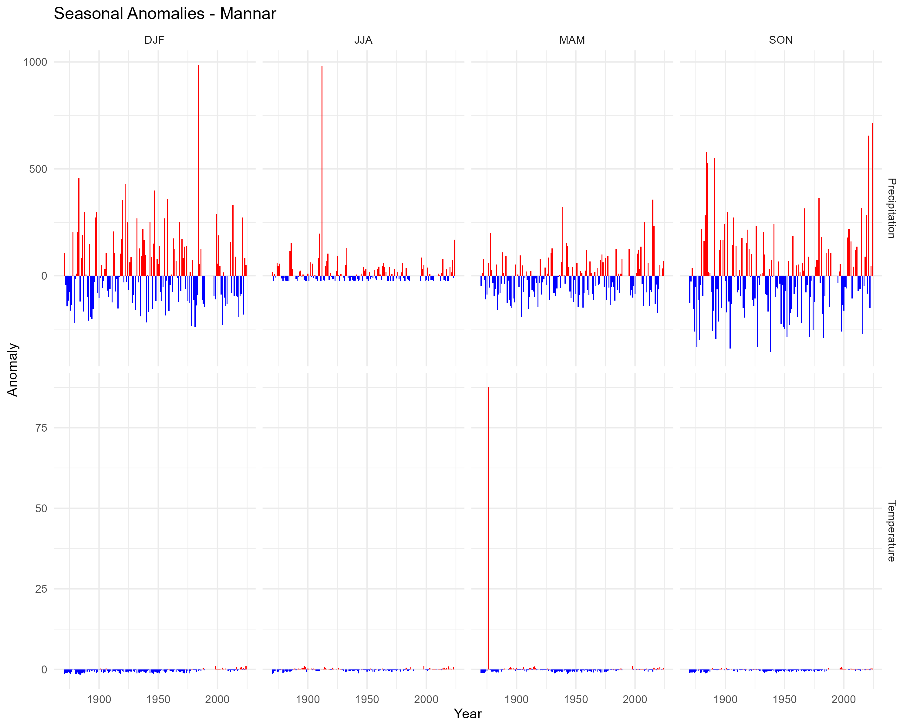

#### Seasonal Variability
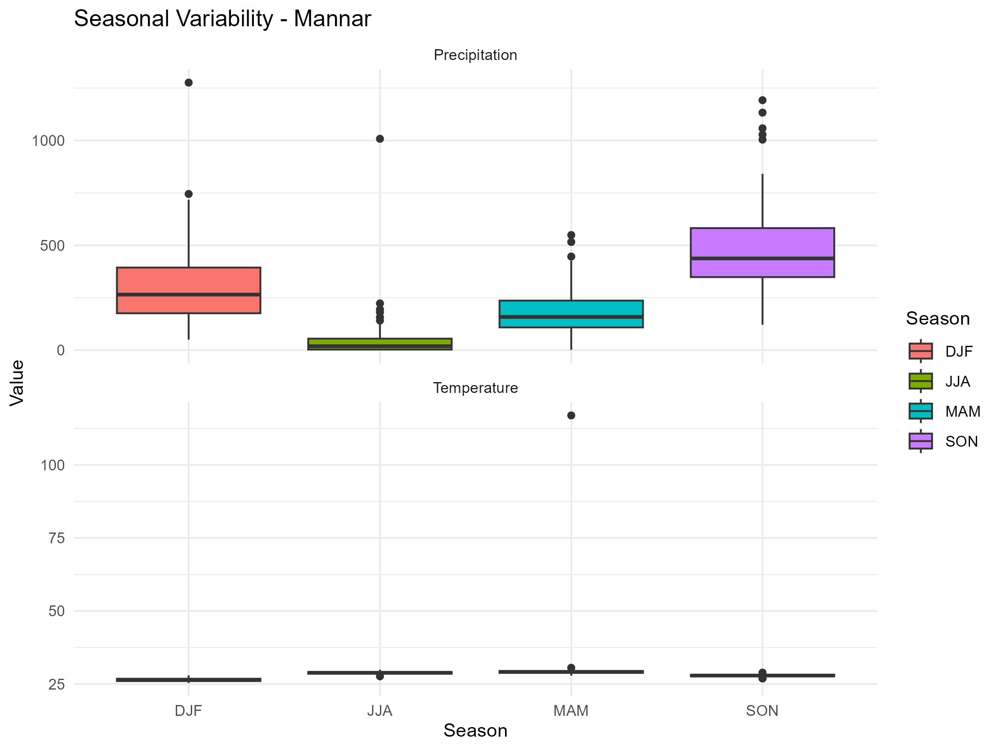

---

##  Nuwara Eliya 

### 1. Trend Analysis
Significant trends detected:
- **Precipitation (JJA)**: Decreasing trend (Slope: -3.3562, p=2.4e-16)
- **Precipitation (SON)**: Decreasing trend (Slope: -0.625, p=0.0264)
- **Temperature (DJF)**: Increasing trend (Slope: 0.0115, p=1.37e-20)
- **Temperature (JJA)**: Increasing trend (Slope: 0.01, p=3.12e-23)
- **Temperature (MAM)**: Increasing trend (Slope: 0.0129, p=2.96e-23)
- **Temperature (SON)**: Increasing trend (Slope: 0.0093, p=1.42e-23)
- **Precipitation (Annual)**: Decreasing trend (Slope: -4.6803, p=2.2e-12)
- **Temperature (Annual)**: Increasing trend (Slope: 0.0114, p=1.17e-30)

### 2. Rainfall-Temperature Correlation
No strong correlations detected.

### 3. Variability (CV %)
| Season | CV (%) | Variability Level |
| :--- | :--- | :--- |
| DJF | 47.2% | Moderate |
| JJA | 39.1% | Moderate |
| MAM | 37.8% | Moderate |
| SON | 26.2% | Moderate |
| Annual | 19.4% | Low |

### 4. Visualizations
#### Annual Time Series

#### Seasonal Anomalies
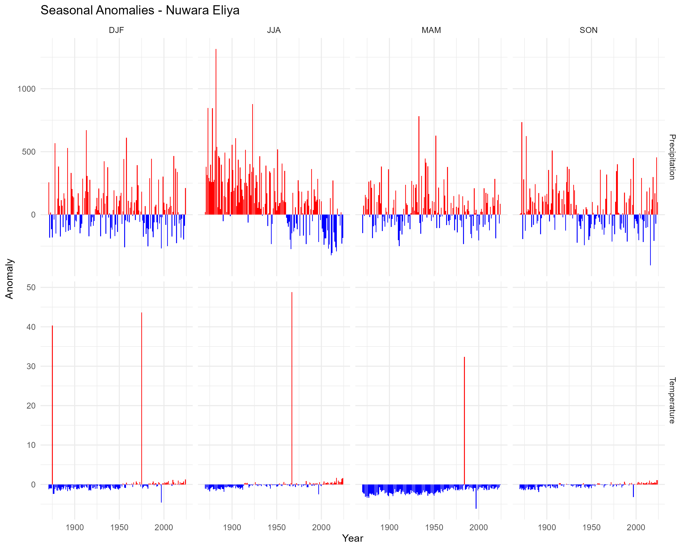

#### Seasonal Variability
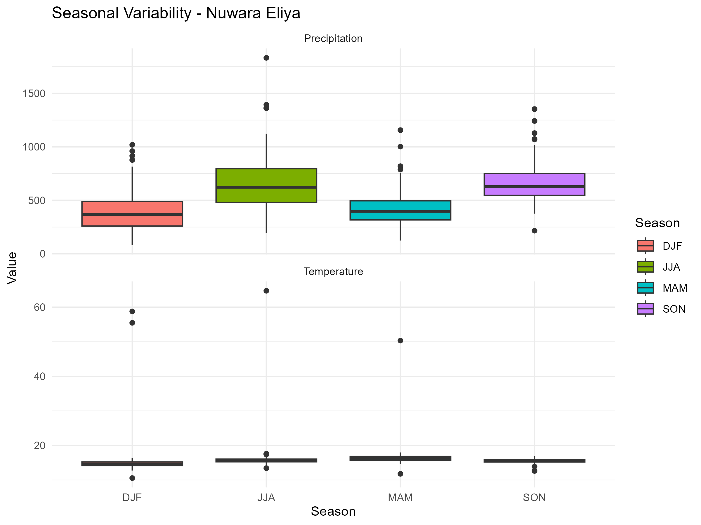

---

##  Puttalam 

### 1. Trend Analysis
Significant trends detected:
- **Precipitation (SON)**: Increasing trend (Slope: 0.7133, p=0.0335)
- **Temperature (DJF)**: Increasing trend (Slope: 0.0097, p=4.43e-16)
- **Temperature (JJA)**: Increasing trend (Slope: 0.0123, p=4.57e-29)
- **Temperature (MAM)**: Increasing trend (Slope: 0.0093, p=8.96e-17)
- **Temperature (SON)**: Increasing trend (Slope: 0.0081, p=1.37e-16)
- **Temperature (Annual)**: Increasing trend (Slope: 0.0094, p=9.59e-18)

### 2. Rainfall-Temperature Correlation
No strong correlations detected.

### 3. Variability (CV %)
| Season | CV (%) | Variability Level |
| :--- | :--- | :--- |
| DJF | 54.6% | High |
| JJA | 80.5% | High |
| MAM | 45.9% | Moderate |
| SON | 34.9% | Moderate |
| Annual | 23.8% | Moderate |

### 4. Visualizations
#### Annual Time Series

#### Seasonal Anomalies
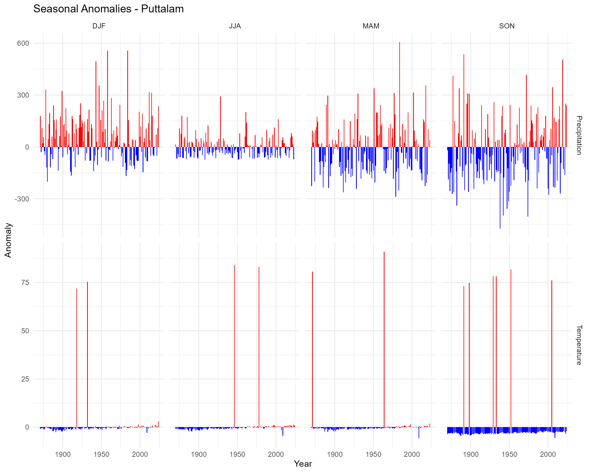

#### Seasonal Variability
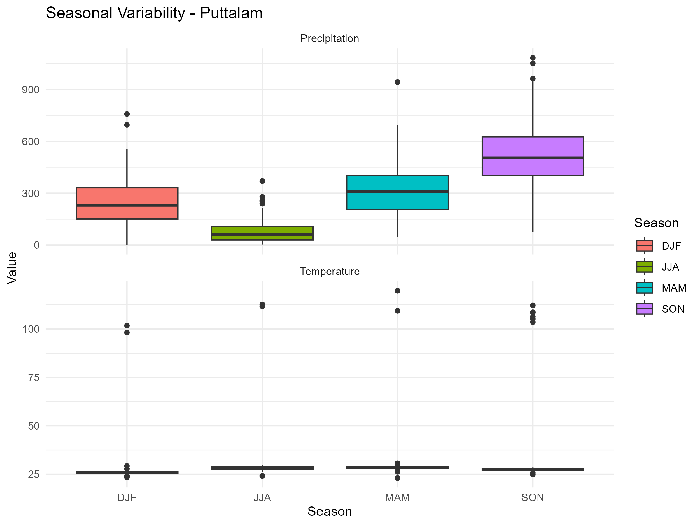

---

##  Rathnapura 

### 1. Trend Analysis
Significant trends detected:
- **Precipitation (JJA)**: Decreasing trend (Slope: -1.0645, p=0.0294)
- **Temperature (DJF)**: Increasing trend (Slope: 0.0071, p=3.49e-12)
- **Temperature (JJA)**: Increasing trend (Slope: 0.0054, p=9.03e-11)
- **Temperature (MAM)**: Increasing trend (Slope: 0.0061, p=5.53e-10)
- **Temperature (SON)**: Increasing trend (Slope: 0.0058, p=7.94e-11)
- **Temperature (Annual)**: Increasing trend (Slope: 0.0064, p=4.53e-12)

### 2. Rainfall-Temperature Correlation
No strong correlations detected.

### 3. Variability (CV %)
| Season | CV (%) | Variability Level |
| :--- | :--- | :--- |
| JJA | 26.6% | Moderate |
| MAM | 25.1% | Moderate |
| SON | 21.2% | Moderate |

### 4. Visualizations
#### Annual Time Series

#### Seasonal Anomalies
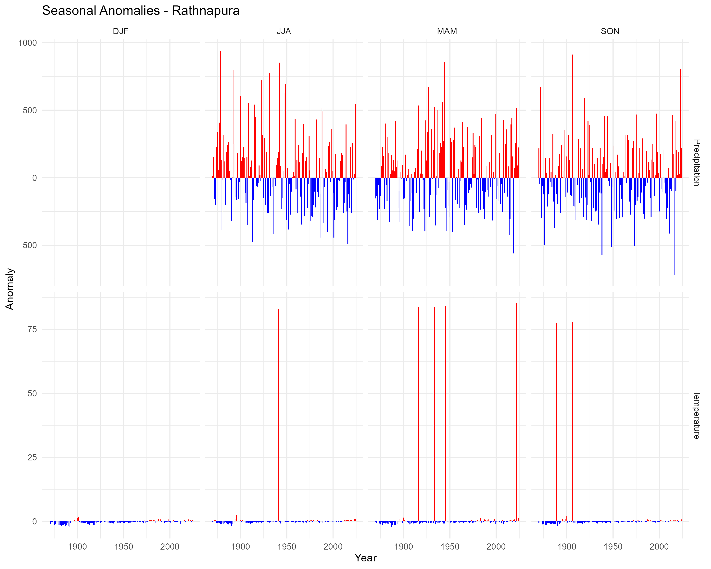

#### Seasonal Variability
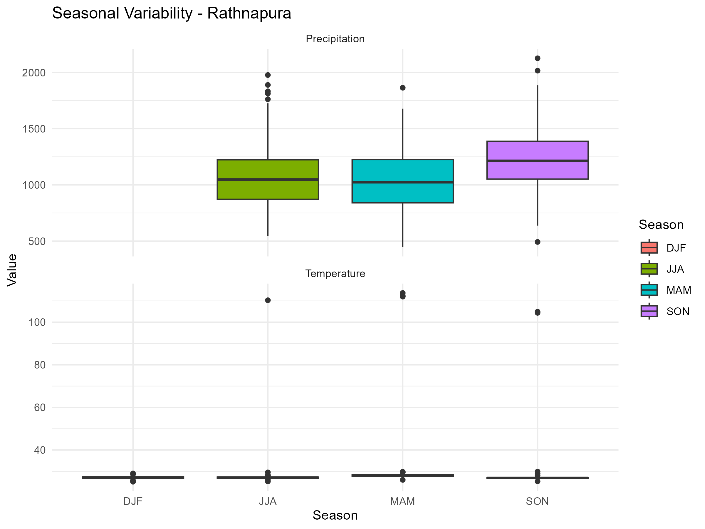

---

##  Trincomalee 

### 1. Trend Analysis
Significant trends detected:
- **Precipitation (JJA)**: Decreasing trend (Slope: -0.3406, p=0.0477)
- **Temperature (DJF)**: Increasing trend (Slope: 0.0039, p=0.00113)
- **Temperature (JJA)**: Increasing trend (Slope: 0.0089, p=9.6e-13)
- **Temperature (MAM)**: Increasing trend (Slope: 0.0041, p=0.00136)
- **Temperature (SON)**: Increasing trend (Slope: 0.0051, p=3.06e-07)
- **Temperature (Annual)**: Increasing trend (Slope: 0.0058, p=2.13e-07)

### 2. Rainfall-Temperature Correlation
No strong correlations detected.

### 3. Variability (CV %)
| Season | CV (%) | Variability Level |
| :--- | :--- | :--- |
| DJF | 48.2% | Moderate |
| JJA | 53.9% | High |
| MAM | 59.7% | High |
| SON | 32.1% | Moderate |
| Annual | 22.1% | Moderate |

### 4. Visualizations
#### Annual Time Series

#### Seasonal Anomalies
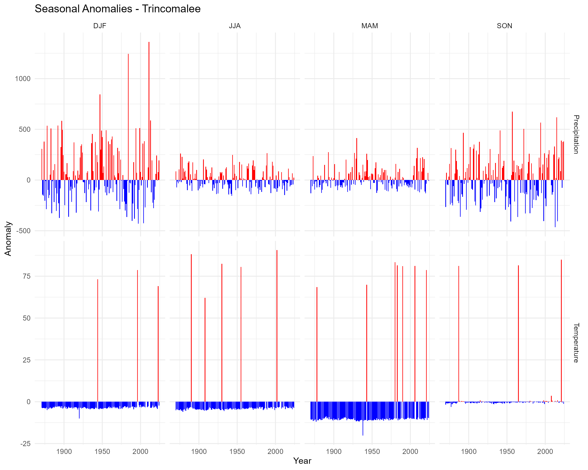

#### Seasonal Variability
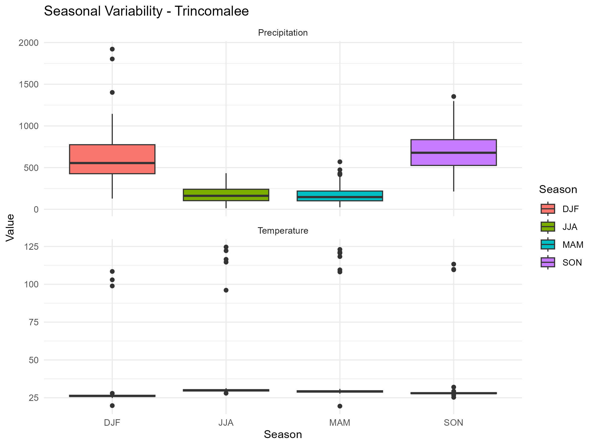

---

